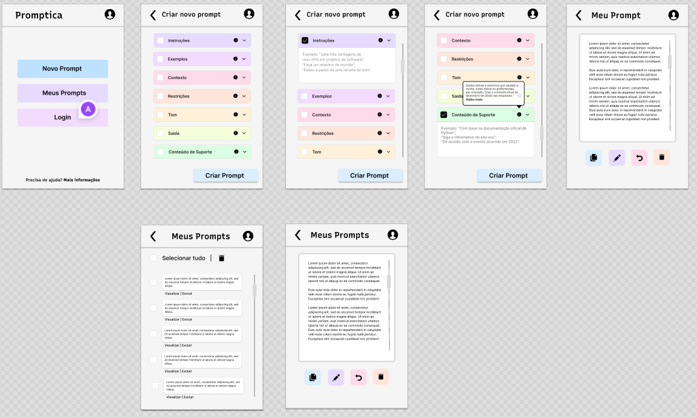

# Promptica 🪄️

> **Extensão Chrome (Manifest v3)** que ajuda qualquer pessoa a criar
> prompts claros e eficientes para modelos de IA, usando um checklist
> visual e boas práticas de _prompt engineering_.

 <!-- (adicione se quiser) -->

---

## ✨ Funcionalidades

| Tela | O que faz |
|------|-----------|
| **Home** | Botões “Novo Prompt”, “Meus Prompts” e “Login/Conta”. |
| **Checklist** | Accordion colorido com instruções, exemplos, contexto, restrições, tom, formato e suporte. — Tooltips de ajuda | Seleção ✓ + textarea. — Gera _prompt_ final sem API externa. |
| **Resultado** | Exibe prompt gerado • Copiar 📋 • Editar ✏️ • Excluir 🗑️ • Voltar ↩️ |
| **Histórico** | Lista prompts salvos localmente • Visualizar • Editar • Excluir. |
| **Usuário** | Login Google¹ (OAuth), editar perfil, ajuda/suporte, política. |

¹ *Login Google requer credencial OAuth tipo **Chrome App** no Google
Cloud Console. Instruções abaixo.*

---

