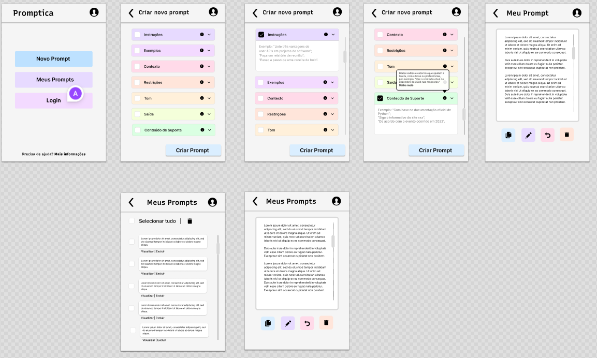

# Promptica 🪄️

> **Extensão Chrome (Manifest v3)** que ajuda qualquer pessoa a criar
> prompts claros e eficientes para modelos de IA, usando um checklist
> visual e boas práticas de _prompt engineering_.

 <!-- (adicione se quiser) -->

---

## ✨ Funcionalidades

| Tela | O que faz |
|------|-----------|
| **Home** | Botões “Novo Prompt”, “Meus Prompts” e “Login/Conta”. |
| **Checklist** | Accordion colorido com instruções, exemplos, contexto, restrições, tom, formato e suporte. — Tooltips de ajuda | Seleção ✓ + textarea. — Gera _prompt_ final sem API externa. |
| **Resultado** | Exibe prompt gerado • Copiar 📋 • Editar ✏️ • Excluir 🗑️ • Voltar ↩️ |
| **Histórico** | Lista prompts salvos localmente • Visualizar • Editar • Excluir. |
| **Usuário** | Login Google¹ (OAuth), editar perfil, ajuda/suporte, política. |

¹ *Login Google requer credencial OAuth tipo **Chrome App** no Google
Cloud Console. Instruções abaixo.*

---

---

## 🎨 Protótipo da Interface

O protótipo inicial da extensão foi desenvolvido no Figma, permitindo validar
a navegação, organização das telas e experiência do usuário antes da implementação.

### Recursos do protótipo
- Fluxo de criação de prompts
- Histórico de prompts salvos
- Telas de login e cadastro
- Perfil do usuário
- Ajuda e suporte

### Links
- Protótipo no Figma: https://www.figma.com/design/VPcMCNYFlAWjY8Byr436Tv/Prot%C3%B3tipo-IHC?node-id=0-1&t=T9E4QTf3fP7PaAcC-1
- Repositório GitHub: https://github.com/aisha-ramiro/promptica-extensao

---

## 🗄️ Banco de Dados

O sistema utiliza uma estrutura simples de banco de dados para armazenar
informações dos usuários e prompts criados dentro da plataforma.

### Estrutura das tabelas

#### `profiles`
Tabela responsável por armazenar os dados do usuário autenticado.

Campos principais:
- `id`: identificador único do usuário
- `nome`: nome do usuário
- `sobrenome`: sobrenome do usuário
- `data_nascimento`: data de nascimento
- `codigo_pais`: código internacional do telefone
- `numero_celular`: número de celular
- `email`: endereço de e-mail
- `criado_em`: data de criação do cadastro
- `atualizado_em`: data da última atualização

#### `prompts`
Tabela responsável por armazenar os prompts criados pelos usuários.

Campos principais:
- `id`: identificador único do prompt
- `usuario_id`: referência ao usuário dono do prompt
- `prompt`: conteúdo do prompt criado
- `criado_em`: data de criação
- `editado_em`: data da última edição

### Relacionamento

A tabela `prompts` possui relacionamento com `profiles` através do campo
`usuario_id`, permitindo que cada usuário possua múltiplos prompts salvos.

### Esquema do banco de dados

### Protótipos das telas

